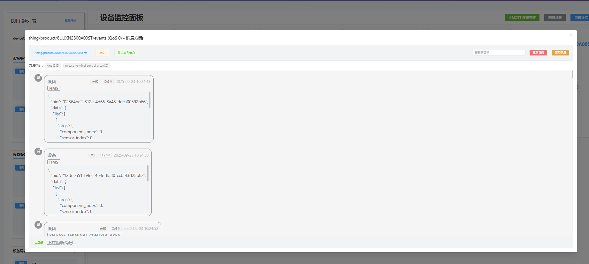

# 大疆无人机设备实时状态监控系统

一个基于 Vue 3 + FastAPI + MQTT 的现代化无人机设备监控平台，支持实时数据接收、设备状态监控、消息管理和 Redis 数据存储。

## 📸 系统截图

### 主界面概览

*系统主界面 - 设备监控面板和主题订阅管理*

### MQTT 连接管理

*MQTT 连接配置和管理界面*

### 设备状态监控

*实时设备状态监控和消息显示*

### Redis 数据管理

*Redis 数据浏览和管理界面*

### 消息详情对话框

*消息详情查看和搜索功能*

### 错误码查询

*DJI 错误码查询和搜索功能*

## ✨ 功能特性

### 🚁 设备监控
- **实时状态监控**：实时显示无人机设备状态和运行数据
- **多主题订阅**：支持订阅多个 MQTT 主题进行数据收集
- **设备卡片**：直观的设备状态卡片展示
- **QoS 级别显示**：显示消息的 QoS 级别信息

### 📡 MQTT 管理
- **连接管理**：支持多个 MQTT 连接配置的保存和管理
- **主题订阅**：可视化主题订阅和取消订阅
- **消息记录**：实时消息接收和历史记录查看
- **消息搜索**：支持消息内容搜索和过滤

### 🗄️ Redis 管理
- **数据浏览**：支持 Redis 数据的可视化浏览
- **多数据类型**：支持 String、Hash、List、Set、ZSet 等数据类型
- **数据操作**：支持数据的增删改查操作
- **连接管理**：支持多个 Redis 连接配置

### 📊 错误码查询
- **DJI 错误码**：内置大疆错误码查询功能
- **快速搜索**：支持错误码的快速搜索和查看
- **详细信息**：提供错误码的详细说明和解决方案

## 🛠️ 技术栈

### 前端
- **Vue 3** - 渐进式 JavaScript 框架
- **Element Plus** - Vue 3 UI 组件库
- **Pinia** - Vue 状态管理
- **Vue Router** - 路由管理
- **Axios** - HTTP 客户端
- **ECharts** - 数据可视化

### 后端
- **FastAPI** - 现代 Python Web 框架
- **SQLite** - 轻量级数据库
- **Redis** - 内存数据库
- **Paho MQTT** - MQTT 客户端库
- **WebSocket** - 实时通信


## 📦 安装和运行

### 环境要求
- Node.js 16+
- Python 3.8+
- Redis 服务器

### 1. 克隆项目
```bash
git clone <repository-url>
cd drone-patrol-web
```

### 2. 创建截图目录（可选）
```bash
# 创建文档和截图目录
mkdir -p docs/screenshots
```

### 3. 安装前端依赖
```bash
npm install
# 或
yarn install
```

### 4. 安装后端依赖
```bash
# 创建虚拟环境
python -m venv .venv

# 激活虚拟环境
# Windows
.venv\Scripts\activate
# Linux/Mac
source .venv/bin/activate

# 安装依赖
pip install -r backend/requirements.txt
```

### 5. 启动服务

#### 开发模式（推荐）
```bash
# 同时启动前端和后端
npm run dev:full
```

#### 分别启动
```bash
# 启动前端开发服务器
npm run dev

# 启动后端 API 服务器
npm run dev:py
```

### 6. 访问应用
- 前端地址：http://localhost:5173
- 后端 API：http://localhost:8080
- API 文档：http://localhost:8080/docs

## 🚀 构建和部署

### 构建前端
```bash
npm run build
```


## 📁 项目结构

```
drone-patrol-web/
├── backend/                 # 后端服务
│   ├── app/
│   │   └── main.py         # FastAPI 主应用
│   ├── data/
│   │   └── backend.db      # SQLite 数据库
│   └── requirements.txt    # Python 依赖
├── src/                    # 前端源码
│   ├── components/         # Vue 组件
│   │   ├── mqtt/          # MQTT 相关组件
│   │   └── redis/         # Redis 相关组件
│   ├── views/             # 页面组件
│   ├── stores/            # Pinia 状态管理
│   ├── api/               # API 接口
│   └── utils/             # 工具函数
├── docs/                  # 项目文档
│   └── screenshots/       # 系统截图
│       ├── main-dashboard.png
│       ├── mqtt-connection.png
│       ├── device-status.png
│       ├── redis-explorer.png
│       ├── message-dialog.png
│       └── error-codes.png
├── public/                # 静态资源
└── dist/                  # 构建输出
```


## 🔧 配置说明

### 环境变量配置
复制 `env.example` 文件为 `.env` 并根据需要修改：

```bash
cp env.example .env
```

环境变量说明：
- `VITE_API_BASE_URL`: 后端 API 基础地址（默认：http://127.0.0.1:18080）
- `VITE_WS_BASE_URL`: WebSocket 基础地址（默认：ws://127.0.0.1:18080）
- `VITE_DEV_MODE`: 开发模式（默认：true）

### MQTT 连接配置
系统支持保存多个 MQTT 连接配置，包括：
- 服务器地址和端口
- 用户名和密码
- 客户端 ID
- 连接协议（TCP/WebSocket）

### Redis 连接配置
支持配置多个 Redis 连接：
- 主机地址和端口
- 数据库编号
- 密码认证

### 数据库
- **SQLite**：存储 MQTT 连接配置和系统设置
- **Redis**：存储实时数据和消息历史

## 📖 使用指南

### 1. 连接 MQTT 服务器
1. 点击右上角"MQTT 连接管理"按钮
2. 配置 MQTT 服务器信息
3. 测试连接并保存配置
4. 选择配置并连接

### 2. 订阅主题
1. 在左侧主题列表中选择要订阅的主题
2. 点击"订阅"按钮
3. 订阅的主题会显示在设备监控面板中

### 3. 查看设备状态
1. 设备状态会实时显示在主面板中
2. 点击设备卡片可查看详细消息
3. 支持消息搜索和过滤

### 4. 管理 Redis 数据
1. 切换到"Redis 管理"页面
2. 配置 Redis 连接
3. 浏览和管理 Redis 数据

## 🐛 故障排除

### 常见问题

1. **MQTT 连接失败**
   - 检查服务器地址和端口
   - 确认用户名密码正确
   - 检查网络连接

2. **Redis 连接失败**
   - 确认 Redis 服务已启动
   - 检查连接配置
   - 确认防火墙设置

3. **前端无法访问后端**
   - 确认后端服务已启动
   - 检查端口是否被占用
   - 查看控制台错误信息

### 日志查看
- 前端日志：浏览器开发者工具控制台
- 后端日志：终端输出
- 数据库日志：SQLite 和 Redis 日志

## 🤝 贡献指南

1. Fork 项目
2. 创建功能分支 (`git checkout -b feature/AmazingFeature`)
3. 提交更改 (`git commit -m 'Add some AmazingFeature'`)
4. 推送到分支 (`git push origin feature/AmazingFeature`)
5. 打开 Pull Request

## 📄 许可证

本项目采用 MIT 许可证 - 查看 [LICENSE](LICENSE) 文件了解详情

## 📞 支持

如有问题或建议，请：
- 提交 Issue
- 发送邮件至 support@example.com
- 查看项目文档

## 🙏 致谢

感谢以下开源项目的支持：
- Vue.js
- Element Plus
- FastAPI
- Redis
- MQTT.js

## 📷 截图说明

### 如何添加截图
1. 将截图文件保存到 `docs/screenshots/` 目录
2. 确保截图文件名与 README 中的引用一致
3. 建议截图尺寸：1920x1080 或 1440x900
4. 推荐使用 PNG 格式以获得更好的显示效果

### 截图清单
- [ ] `main-dashboard.png` - 主界面概览
- [ ] `mqtt-connection.png` - MQTT 连接管理
- [ ] `device-status.png` - 设备状态监控
- [ ] `redis-explorer.png` - Redis 数据管理
- [ ] `message-dialog.png` - 消息详情对话框
- [ ] `error-codes.png` - 错误码查询


---

**大疆无人机设备实时状态监控系统** - 让无人机监控更简单、更高效！
